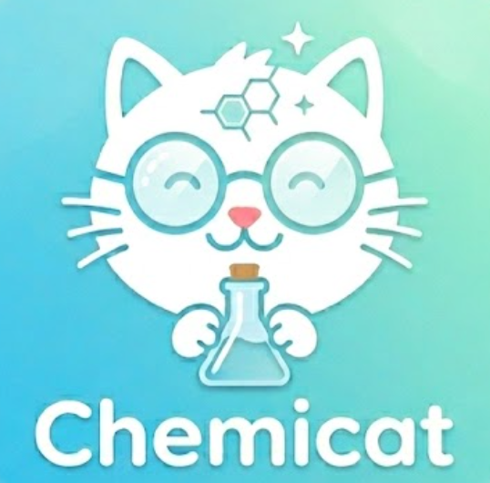

<div align="center">



# Chemicat

**边背化学，边养猫 🐱⚗️**

一个专为化学学习者设计的单词记忆应用，用游戏化的养猫机制让枯燥的化学术语记忆变得有趣。

[](https://react.dev/)
[](https://vitejs.dev/)
[](https://reactrouter.com/)
[](LICENSE)

</div>

---

## ✨ 功能亮点

### 📚 化学单词记忆
- **直接内置双词库**：「大学化学」和「化学原理」两套词库开箱即用，覆盖从元素符号到有机物的全面化学词汇
- **分章节学习**：按知识点章节组织，系统推进
- **两轮闯关**：第一遍英译中、第二遍中译英，双向强化记忆
- **四选一题目与灵活翻页**：智能生成干扰选项，并支持向前重做或向后跳过题目
- **收藏夹**：⭐ 标记难记的单词，汇入「重点记忆」词库专项攻克
- **进度保存**：随时中断，下次继续，不丢失学习进度

### 🐱 虚拟猫咪养成
- **6 只猫咪可选**：小煤球、小橘子、小泡芙，每只各有两个主题造型
- **动态状态系统**：猫咪拥有**饱食度**和**亲密度**两项属性，随时间实时变化
- **互动玩法**：
  - 🍽️ **投喂**：消耗 3 份猫粮，饱食度 +1
  - 🤚 **抚摸**：随机触发亲密度提升
- **猫粮经济**：每答对一道题获得 1 份猫粮，学习即是奖励
- **视频动画**：猫咪根据状态（开心/饥饿/进食/被摸）切换不同动态表情

### 🎮 用户体验
- **新手引导流程**：注册用户名 → 选猫 → 给猫起名 → 开始学习
- **数据本地持久化**：所有进度保存在浏览器 `localStorage`，刷新不丢失
- **流畅导航**：底部 Tab 栏在「我的猫」「单词记忆」「我的」三个主要页面间切换
- **账号注销**：支持一键注销并清空所有本地数据，并带有二次确认防止误触

---

## 📦 词库内容

| 词库 | 章节示例 |
|------|---------|
| **大学化学** | 前二十个元素、含氧酸根、酸、碱、盐、有机物、常见阴阳离子… |
| **化学原理** | 物质与测量、原子与离子、化学键、分子几何构型、热化学、化学平衡、酸碱平衡、电化学… |
| **重点记忆** | 由用户自行收藏的单词动态组成 |

---

## 🚀 快速开始

### 环境要求

- Node.js ≥ 18
- npm ≥ 9

### 安装与运行

```bash
# 克隆仓库
git clone https://github.com/AlexLiu2077/Chemicat.git
cd Chemicat

# 安装依赖
npm install

# 启动开发服务器
npm run dev
```

浏览器访问 `http://localhost:5173` 即可开始使用。

### 构建生产版本

```bash
npm run build
npm run preview
```

---

## 🗂️ 项目结构

```
Chemicat/
├── public/
│   └── assets/
│       ├── cats/          # 猫咪图片
│       ├── videos/        # 猫咪动态视频（各状态）
│       └── cover/         # 词库封面图
├── src/
│   ├── pages/             # 页面组件
│   │   ├── SplashPage     # 启动页
│   │   ├── RegisterPage   # 注册（设置用户名）
│   │   ├── WelcomePage    # 欢迎页
│   │   ├── CatSelectPage  # 选猫页面
│   │   ├── CatNamingPage  # 给猫起名
│   │   └── MainPage       # 主页（Tab 导航）
│   ├── components/
│   │   └── tabs/
│   │       ├── MyCatTab         # 我的猫（互动）
│   │       ├── WordMemoryTab    # 单词记忆（核心功能）
│   │       └── UserStatusTab    # 用户状态
│   ├── context/
│   │   └── UserContext    # 全局状态管理（用户、猫、进度）
│   └── data/
│       ├── cats.js            # 猫咪数据
│       ├── wordbooks.js       # 词库定义
│       └── chapterChapters.js # 教材章节词汇
└── words/                 # 原始词汇参考文档（.docx）
```

---

## 🛠️ 技术栈

| 技术 | 用途 |
|------|------|
| React 19 | UI 框架 |
| React Router v7 | 客户端路由 |
| CSS Modules | 样式隔离 |
| Vite 8 | 构建工具 |
| localStorage | 数据持久化 |

---

## 📄 License

MIT © 2025 Chemicat
